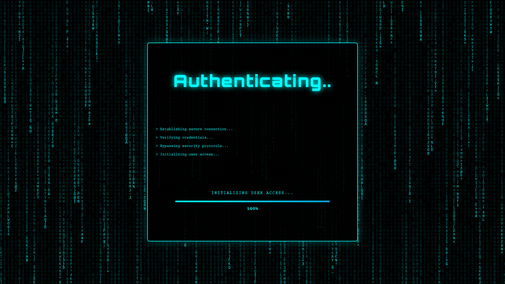
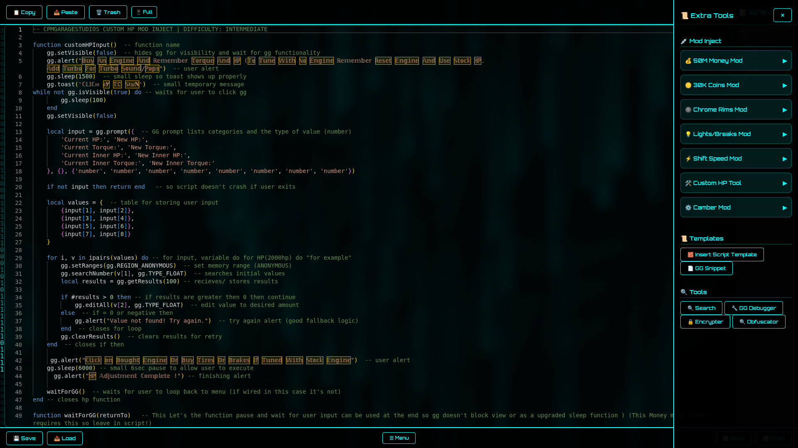
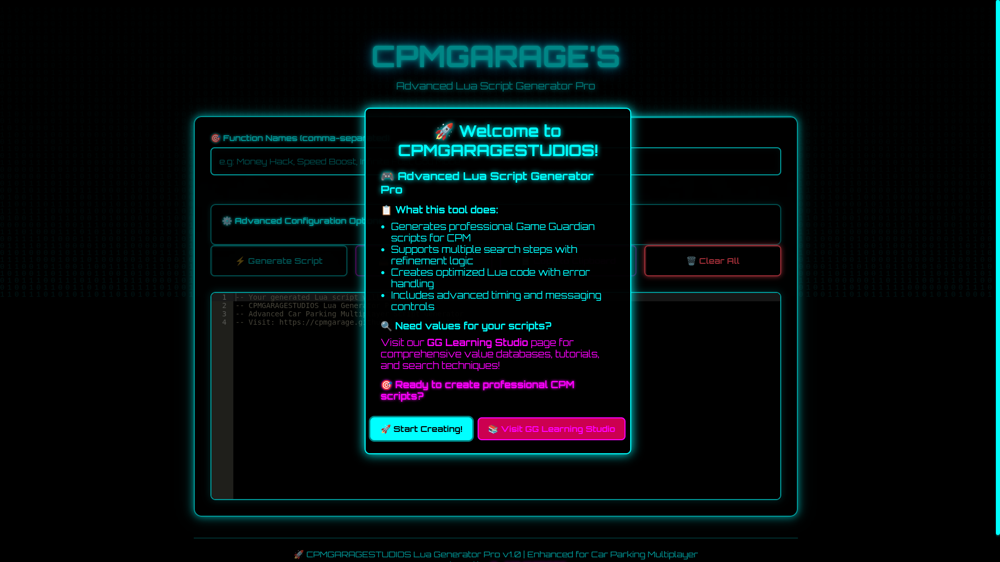

# GameGuardian Lua Script 🔧

Welcome to my beginnings in Lua scripting and reverse engineering. This repository contains my early GameGuardian script, created for research, learning, and personal development.  

> ⚠️ Disclaimer: Use for educational and research purposes only. I am not responsible for any misuse of this script.  

---

## Status: Archived
> *This project represents my early reverse engineering and scripting work. It is no longer maintained, but remains public for educational and historical purposes.*

## 💻 About

This script marks my starting point in tool development, automation, and reverse engineering within mobile games. It demonstrates practical Lua scripting, memory experimentation, and my early approach to building structured custom tools.

- The project was developed on a non-root Samsung device, without Frida or dump.cs access. Working under these constraints forced me to think differently, strategize more carefully, and develop alternative problem-solving approaches that later shaped how I design tools and systems.

- This script was created updates ago, functionality is not guaranteed. This repos purpose is to document my technical growth and achievements, as well as be a research resource for lua script developers.

---

## 🔧 Features

- Automation of in-game tasks via Lua scripting  
- Research-focused memory manipulation techniques  
- Modular design for learning & experimentation  
- Easy to read and modify for beginners  

---

## 📂 File Structure
-  /delta-script    # Group only script
-  /first-script    # First script ever!
-  /screenshots     # Pictures of Website & Script
-  /script          # Main Master Lua script
-  /templates       # GG Lua Templates
-  HELP.md          # Basic Description / Help
-  LICENSE          # MIT License
-  README.md        # Readme page

---

## 🔗 Resources
- Game Guardian: [GameGuardian Official Website](https://gameguardian.net/)
- Lua language documentation: [https://www.lua.org/manual/5.1/](https://www.lua.org/manual/5.1/)

---

## 🌐 Modding Website

I also developed a modding website where I host scripts, tools, and resources for learning and experimentation.  
Check it out: [CPMGARAGESTUDIOS](https://cpmgarage.github.io/cpmgaragestudios/)  

*Note: The site is still in development, mostly a old passion project but it gives a good idea of the tools and projects I’m working on.*
- Here are a few snapshots of my modding platform and available templates:

## 🌐 Contact

---

> “My scripting beginnings. Learning every byte and instruction along the way.” 🖤
